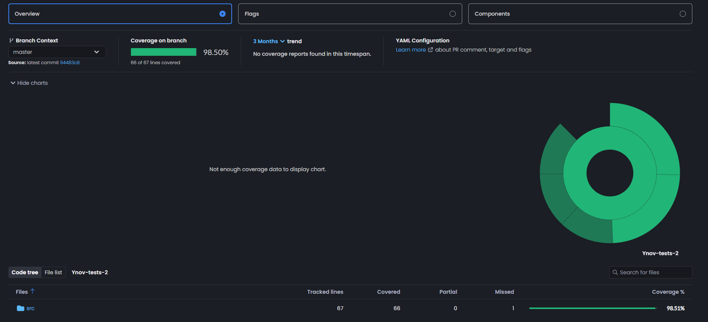

# Getting Started with Create React App

This project was bootstrapped with [Create React App](https://github.com/facebook/create-react-app).

- [Getting Started with Create React App](#getting-started-with-create-react-app)
  - [Available Scripts](#available-scripts)
    - [`npm start`](#npm-start)
    - [`npm test`](#npm-test)
    - [`npm run build`](#npm-run-build)
    - [`npm run eject`](#npm-run-eject)
  - [Learn More](#learn-more)
    - [Code Splitting](#code-splitting)
    - [Analyzing the Bundle Size](#analyzing-the-bundle-size)
    - [Making a Progressive Web App](#making-a-progressive-web-app)
    - [Advanced Configuration](#advanced-configuration)
    - [Deployment](#deployment)
    - [`npm run build` fails to minify](#npm-run-build-fails-to-minify)
  - [Les Mocks](#les-mocks)
- [Déploiement NPM](#déploiement-npm)
- [Liens](#liens)


## Available Scripts

In the project directory, you can run:

### `npm start`

Runs the app in the development mode.\
Open [http://localhost:3000](http://localhost:3000) to view it in your browser.

The page will reload when you make changes.\
You may also see any lint errors in the console.

### `npm test`

Launches the test runner in the interactive watch mode.\
See the section about [running tests](https://facebook.github.io/create-react-app/docs/running-tests) for more information.

### `npm run build`

Builds the app for production to the `build` folder.\
It correctly bundles React in production mode and optimizes the build for the best performance.

The build is minified and the filenames include the hashes.\
Your app is ready to be deployed!

See the section about [deployment](https://facebook.github.io/create-react-app/docs/deployment) for more information.

### `npm run eject`

**Note: this is a one-way operation. Once you `eject`, you can't go back!**

If you aren't satisfied with the build tool and configuration choices, you can `eject` at any time. This command will remove the single build dependency from your project.

Instead, it will copy all the configuration files and the transitive dependencies (webpack, Babel, ESLint, etc) right into your project so you have full control over them. All of the commands except `eject` will still work, but they will point to the copied scripts so you can tweak them. At this point you're on your own.

You don't have to ever use `eject`. The curated feature set is suitable for small and middle deployments, and you shouldn't feel obligated to use this feature. However we understand that this tool wouldn't be useful if you couldn't customize it when you are ready for it.

## Learn More

You can learn more in the [Create React App documentation](https://facebook.github.io/create-react-app/docs/getting-started).

To learn React, check out the [React documentation](https://reactjs.org/).

### Code Splitting

This section has moved here: [https://facebook.github.io/create-react-app/docs/code-splitting](https://facebook.github.io/create-react-app/docs/code-splitting)

### Analyzing the Bundle Size

This section has moved here: [https://facebook.github.io/create-react-app/docs/analyzing-the-bundle-size](https://facebook.github.io/create-react-app/docs/analyzing-the-bundle-size)

### Making a Progressive Web App

This section has moved here: [https://facebook.github.io/create-react-app/docs/making-a-progressive-web-app](https://facebook.github.io/create-react-app/docs/making-a-progressive-web-app)

### Advanced Configuration

This section has moved here: [https://facebook.github.io/create-react-app/docs/advanced-configuration](https://facebook.github.io/create-react-app/docs/advanced-configuration)

### Deployment

This section has moved here: [https://facebook.github.io/create-react-app/docs/deployment](https://facebook.github.io/create-react-app/docs/deployment)

### `npm run build` fails to minify

This section has moved here: [https://facebook.github.io/create-react-app/docs/troubleshooting#npm-run-build-fails-to-minify](https://facebook.github.io/create-react-app/docs/troubleshooting#npm-run-build-fails-to-minify)


## Les Mocks

Dans les tests E2E (cypress/e2e/), les appels API sont interceptés grâce à ```cy.intercept()```.
Cela permet de modifier les comportement de l'API pour des tests sans avoir à modifier l'API elle-meme.

On peux simuler des requête réussis (code 200/201), des erreurs métier, par exemple quand un email est déjà utilisé (code 400) ou des erreurs serveur (code 500).


La ligne ```jest.mock("../../api/userAPI");``` Permet de simulé divers réponses API dans les tests.
Ainsi on peut simulé les meme réponse API qu'avec Cypress.

|Type de Retour| Jest | Cypress |
|:-------------|:----|:------|
| code 201     |```createUser.mockResolvedValue({ id: 1, email: "test@mail.com" });```|```cy.intercept("POST", API_URL, {statusCode: 201,body: {id: 12,...validUser,},}).as("createUser200");```|
| code 400     |```createUser.mockRejectedValue(new Error("EMAIL_EXISTS"));```|```cy.intercept("POST", API_URL, {statusCode: 400,body: {error: "EMAIL_EXISTS",},}).as("emailExists");```|
| code 500     |```createUser.mockRejectedValue(new Error("SERVER_ERROR"));```|```cy.intercept("POST", API_URL, {statusCode: 500,body: {error: "Internal Server Error",},}).as("serverError500")```|

# Déploiement NPM
Commande de versioning:  
```npm version patch``` → 1.0.0 → 1.0.1  
```npm version minor``` → 1.0.1 → 1.1.0  
```npm version major``` → 1.1.0 → 2.0.0


# Liens
Lien du repo: https://github.com/Brookimakii/Ynov-tests-2/  
Lien du site: https://brookimakii.github.io/Ynov-tests-2/  
Lien de la documentation: https://brookimakii.github.io/Ynov-tests-2/documentation  
Lien du Codecov: https://app.codecov.io/github/Brookimakii/Ynov-tests-2/tree/master  
Lien du package npm: https://www.npmjs.com/package/kenzo-h-thomias-integration-lecture-app

---

Screenshot du dashboard Codecov;


---